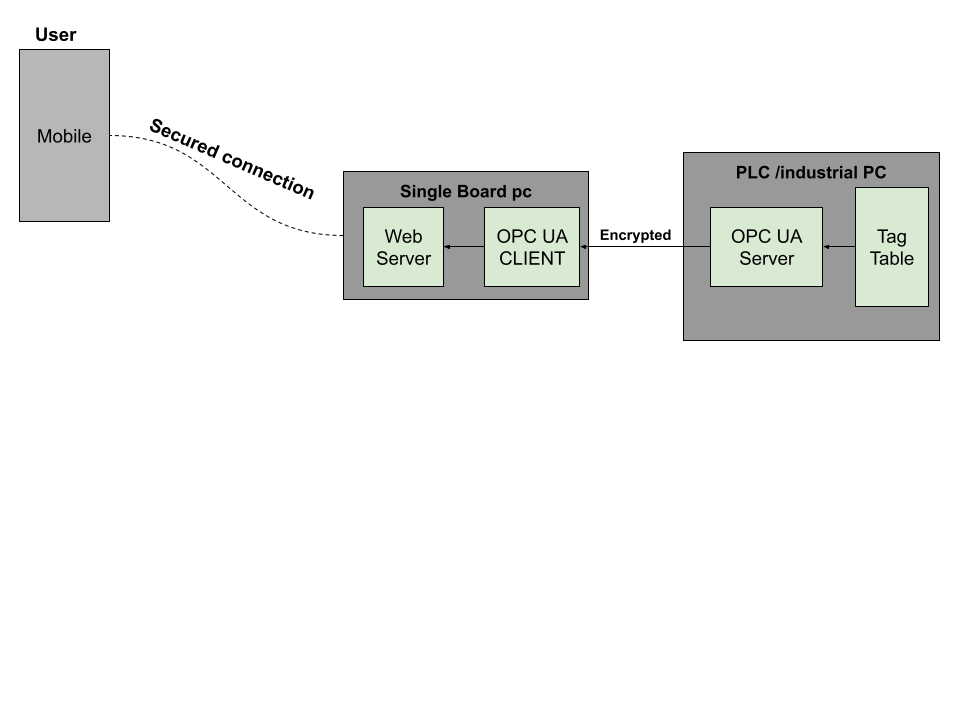

# WWW Mach

With the advent of Industry 4.0, there is an increasing demand for global access to industrial machines performing critical tasks. These machines need to be monitored worldwide by authorized stakeholders. However, it is imperative that this access is secure.

This project represents my attempt to develop a secure solution for machine access by leveraging high-level network protocols and adhering to best security practices.

## Solution

## UA Secure client

**OPC UA** is a machine-to-machine communication protocol for industrial automation. It is designed to facilitate **secure and reliable exchange of data** and ensure **interoperability** between devices from different manufacturers. **OPC UA ensures the security of data transfer**.

For more information, see the [OPC Foundation](https://opcfoundation.org/about/opc-technologies/opc-ua/).

In this project, we're using the **open62541pp** library ([GitHub](https://github.com/open62541pp/open62541pp)). **open62541pp** is a **C++ wrapper library** for one of the most performant open-source C-based libraries for OPC UA, **open62541** ([open62541.org](https://www.open62541.org/)).

Another option, if you're trying to replicate this project in **Python**, would be **opcua-asyncio** ([GitHub](https://github.com/FreeOpcUa/opcua-asyncio)). I previously worked on a similar project using this library ([Remote_UA](https://github.com/MisanExe/Remote_UA)). You can take a look to get a sense of how it works.

In our case were using 

### Build instructions to build our secure client
#### Add build instructions for open62541pp here